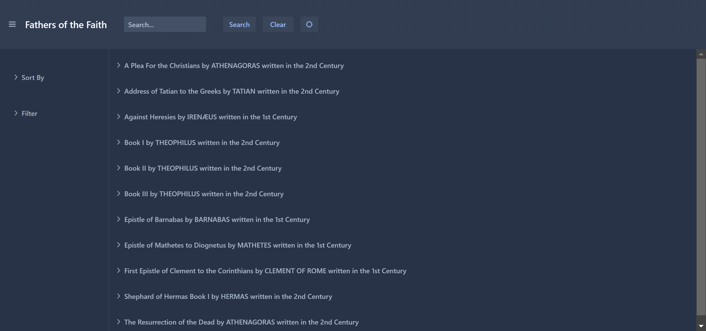
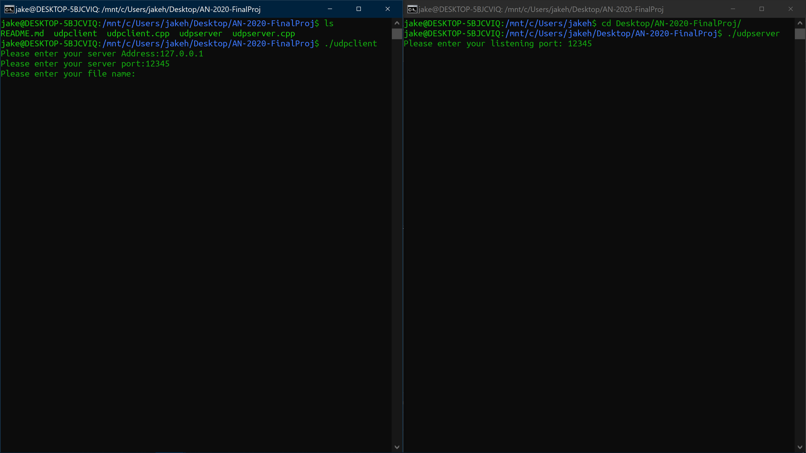

Portfolio
=========

Programming Projects
--------------------

---
### [Fathers of the Faith - Senior Project | CSCI 497/498/499](project1)

---
### [Applied Networking Final Project | CSCI 332](project2)

---
### [Pentesting Project II | CSCI 325](project3)

---
### [Database Final Project | CSCI 419](project4)

---

Ethics Papers
-------------

### [CSCI 325 - Ethics in Cybersecurity](/pdf/325-Ethics-Paper.pdf)

-   **Class:**  CSCI 325
-   **Grade:** 100

### [CSCI 325 - Ethics of Meme Culture](/pdf/325-Ethics-Paper.pdf)

-   **Class:**  CSCI 330 (I believe, but I could be wrong)
-   **Grade:** 100

---

Presentations
-------------

### [CSU PSEUDOvirus](https://docs.google.com/presentation/d/1x1GSk1e2KhMP33CKT_cJKzAosfteNcpVNVjwaI1KDOU/edit?usp=sharing)

- **Class:** CSCI 405
- **Grade:** 100

### [Application Security](https://www.youtube.com/watch?v=_XjiHC_2IGY)

- **Class:** CSCI 325
- **Grade:** 100

---

